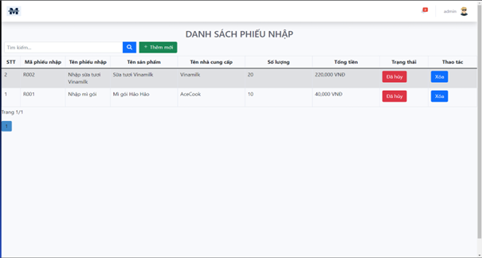

# Mô tả cơ sở dữ liệu (SQL Server)

1. **Bảng danh mục**

   | Field Name   | Data Type       | Null | Key           | Description          |
   |--------------|-----------------|------|---------------|----------------------|
   | STT          | int             | No   |               | Số thứ tự danh mục  |
   | CategoryID   | nvarchar(8)     | No   | PK            | ID danh mục          |
   | CategoryName | nvarchar(50)    | No   |               | Tên danh mục         |
   | Description  | nvarchar(100)   | Yes  |               | Mô tả danh mục      |
   | Updated      | datetime        | No   |               | Ngày cập nhật        |

   Bảng 1: Bảng danh mục

2. **Bảng khuyến mãi**

   | Field Name         | Data Type       | Null | Key           | Description             |
   |--------------------|-----------------|------|---------------|-------------------------|
   | CouponID           | nvarchar(12)    | No   | PK            | ID mã khuyến mãi       |
   | CouponDescription  | nvarchar(100)   | Yes  |               | Mô tả khuyến mãi       |
   | CouponValue        | int             | No   |               | Giá trị                 |
   | CouponExpire       | datetime        | No   |               | Hạn sử dụng             |

   Bảng 2: Bảng khuyến mãi

3. **Bảng sử dụng khuyến mãi**

   | Field Name   | Data Type    | Null | Key          | Description             |
   |--------------|--------------|------|--------------|-------------------------|
   | CouponID     | nvarchar(12) | No   | PK, FK(Coupon) | ID mã khuyến mãi      |
   | CustomerID   | nvarchar(12) | No   | FK(Customer) | ID khách hàng           |

   Bảng 3: Bảng sử dụng khuyến mãi

4. **Bảng khách hàng**

   | Field Name   | Data Type       | Null | Key           | Description         |
   |--------------|-----------------|------|---------------|---------------------|
   | STT          | int             | Yes  |               | Số thứ tự           |
   | CustomerID   | nvarchar(12)    | No   | PK            | ID khách hàng       |
   | CustomerName | nvarchar(30)    | No   |               | Tên khách hàng      |
   | Birthday     | date            | No   |               | Ngày sinh           |
   | Address      | nvarchar(50)    | No   |               | Địa chỉ             |
   | Sex          | nvarchar(3)     | No   |               | Giới tính           |
   | Email        | nvarchar(80)    | No   |               | Email khách hàng    |
   | Phone        | nchar(10)       | No   |               | Số điện thoại       |
   | Updated      | datetime        | Yes  |               | Ngày cập nhật       |

   Bảng 4: Bảng khách hàng

5. **Bảng nhân viên**

   | Field Name   | Data Type       | Null | Key           | Description         |
   |--------------|-----------------|------|---------------|---------------------|
   | STT          | int             | Yes  |               | Số thứ tự           |
   | EmployeeID   | nvarchar(12)    | No   | PK            | ID nhân viên        |
   | EmployeeName | nvarchar(25)    | No   |               | Tên nhân viên       |
   | Birthday     | date            | No   |               | Ngày sinh           |
   | Address      | nvarchar(80)    | No   |               | Địa chỉ             |
   | Sex          | nvarchar(3)     | No   |               | Giới tính           |
   | Email        | nvarchar(50)    | No   |               | Email                |
   | Phone        | nvarchar(13)    | No   |               | Số điện thoại       |
   | Title        | nvarchar(10)    | No   |               | Chức vụ             |
   | Updated      | datetime        | Yes  |               | Ngày cập nhật       |

   Bảng 5: Bảng nhân viên
6. **Bảng phiếu nhập**

   | Field Name   | Data Type       | Null | Key           | Description         |
   |--------------|-----------------|------|---------------|---------------------|
   | STT          | int             | Yes  |               | Số thứ tự           |
   | GRNID        | nvarchar(8)     | No   | PK            | ID phiếu nhập       |
   | GRNName      | nvarchar(50)    | No   |               | Tên phiếu nhập      |
   | Amount       | decimal(18,0)   | No   |               | Thành tiền          |
   | Date         | datetime        | No   |               | Ngày lập phiếu      |
   | Status       | bit             | No   |               | Trạng thái          |

   Bảng 6: Bảng phiếu nhập

7. **Bảng chi tiết phiếu nhập**

   | Field Name   | Data Type       | Null | Key           | Description         |
   |--------------|-----------------|------|---------------|---------------------|
   | STT          | int             | Yes  |               | Số thứ tự           |
   | GRNID        | nvarchar(8)     | No   | PK, FK(GoodsReceivedNote) | ID phiếu nhập |
   | ItemID       | int             | No   | PK            | ID đánh dấu sản phẩm |
   | ProductID    | nvarchar(8)     | No   | FK(Product)   | ID sản phẩm         |
   | Quantity     | int             | No   |               | Số lượng            |
   | UnitPrice_inp| decimal(18,0)   | No   |               | Giá nhập            |
   | Amount       | decimal(18,0)   | No   |               | Thành tiền          |

   Bảng 7: Bảng chi tiết phiếu nhập

8. **Bảng tin tức**

   | Field Name   | Data Type       | Null | Key           | Description         |
   |--------------|-----------------|------|---------------|---------------------|
   | NewsID       | nvarchar(8)     | No   | PK            | ID bài viết         |
   | NewsAuthor   | nvarchar(30)    | Yes  |               | Tác giả bài viết   |
   | NewsTitle    | nvarchar(100)   | No   |               | Tiêu đề bài viết   |
   | NewsContent  | nvarchar(4000)  | No   |               | Nội dung bài viết  |
   | Thumbnail    | nvarchar(50)    | Yes  |               | Ảnh bài viết       |
   | Updated      | date            | No   |               | Ngày cập nhật       |

   Bảng 8: Bảng tin tức

9. **Bảng hóa đơn**

   | Field Name    | Data Type       | Null | Key           | Description         |
   |---------------|-----------------|------|---------------|---------------------|
   | OrderID       | nvarchar(11)    | No   | PK            | ID hóa đơn          |
   | CustomerID    | nvarchar(12)    | No   | FK(Customer)  | ID khách hàng       |
   | Amount        | decimal(18,0)   | No   |               | Thành tiền          |
   | Address       | nvarchar(50)    | No   |               | Địa chỉ giao hàng  |
   | InvoiceDate   | datetime        | No   |               | Ngày xuất hóa đơn  |
   | PayStatus     | bit             | No   |               | Trạng thái thanh toán |
   | DeliveryStatus| bit             | No   |               | Trạng thái vận chuyển |
   | PaymentID     | nvarchar(10)    | No   | FK(Payment)   | ID phương thức thanh toán |
   | Coupon        | int             | No   |               | Khuyến mãi          |
   | Tax           | int             | No   |               | Thuế                |
   | Updated       | datetime        | No   |               | Ngày cập nhật       |

   Bảng 9: Bảng hóa đơn

10. **Bảng chi tiết hóa đơn**

    | Field Name   | Data Type       | Null | Key           | Description         |
    |--------------|-----------------|------|---------------|---------------------|
    | OrderID      | nvarchar(11)    | No   | FK(Order)     | ID hóa đơn          |
    | ItemID       | int             | No   |               | ID đánh dấu sản phẩm|
    | ProductID    | nvarchar(8)     | No   | FK(Product)   | ID sản phẩm         |
    | Quantity     | int             | No   |               | Số lượng            |
    | UnitPrice    | decimal(18,0)   | No   |               | Đơn giá             |
    | Amount       | decimal(18,0)   | No   |               | Thành tiền          |

    Bảng 10: Bảng chi tiết hóa đơn

11. **Bảng phương thức thanh toán**

    | Field Name   | Data Type       | Null | Key           | Description         |
    |--------------|-----------------|------|---------------|---------------------|
    | PaymentID    | nvarchar(10)    | No   | PK            | ID phương thức thanh toán |
    | PaymentType  | nvarchar(10)    | No   |               | Loại phương thức thanh toán |

    Bảng 11: Bảng phương thức thanh toán

12. **Bảng sản phẩm**

    | Field Name   | Data Type       | Null | Key           | Description         |
    |--------------|-----------------|------|---------------|---------------------|
    | STT          | int             | Yes  |               | Số thứ tự           |
    | ProductID    | nvarchar(8)     | No   | PK            | ID sản phẩm         |
    | ProductName  | nvarchar(50)    | No   |               | Tên sản phẩm        |
    | Description  | nvarchar(500)   | Yes  |               | Mô tả               |
    | Unit         | nvarchar(5)     | No   |               | Đơn vị tính         |
    | Price        | decimal(18,0)   | No   |               | Giá                 |
    | ProviderID   | nvarchar(8)     | No   | FK(Provider)  | ID nhà cung cấp    |
    | Quantity     | int             | No   |               | Số lượng            |
    | CategoryID   | nvarchar(8)     | No   | FK(Category)  | ID danh mục         |
    | Picture      | nvarchar(100)   | Yes  |               | Ảnh sản phẩm        |
    | Sale         | int             | Yes  |               | Giảm giá            |
    | Updated      | datetime        | No   |               | Ngày cập nhật       |

    Bảng 12: Bảng sản phẩm

13. **Bảng nhà cung cấp**

    | Field Name   | Data Type       | Null | Key           | Description         |
    |--------------|-----------------|------|---------------|---------------------|
    | STT          | int             | Yes  |               | Số thứ tự           |
    | ProviderID   | nvarchar(8)     | No   | PK            | ID nhà cung cấp     |
    | ProviderName | nvarchar(50)    | No   |               | Tên nhà cung cấp    |
    | Description  | nvarchar(200)   | Yes  |               | Mô tả               |
    | Logo         | nvarchar(40)    | No   |               | Logo nhà cung cấp   |

    Bảng 13: Bảng nhà cung cấp

14. **Bảng liên hệ**

    | Field Name         | Data Type       | Null | Key           | Description         |
    |--------------------|-----------------|------|---------------|---------------------|
    | ResponseID         | nvarchar(12)    | No   | PK            | ID phản hồi         |
    | ResponseGuestName  | nvarchar(30)    | No   |               | Tên người phản hồi  |
    | ResponseEmail      | nvarchar(50)    | No   |               | Email người phản hồi|
    | ResponseContent    | nvarchar(1000)  | No   |               | Nội dung phản hồi   |
    | ResponseStatus     | bit             | No   |               | Trạng thái          |
    | Updated            | datetime        | No   |               | Ngày cập nhật       |

    Bảng 14: Bảng liên hệ

15. **Bảng người dùng**

    | Field Name   | Data Type       | Null | Key           | Description         |
    |--------------|-----------------|------|---------------|---------------------|
    | STT          | int             | Yes  |               | Số thứ tự           |
    | UserName     | nvarchar(50)    | No   | PK            | Tài khoản           |
    | Password     | nvarchar(50)    | No   |               | Mật khẩu            |
    | Permission   | int             | No   |               | Quyền               |
    | EmployeeID   | nvarchar(12)    | Yes  | FK(Employee)  | ID nhân viên        |
    | CustomerID   | nvarchar(12)    | Yes  | FK(Customer)  | ID khách hàng       |

    Bảng 15: Bảng người dùng

# Demo sản phẩm

## 1. Giao diện người dùng

### 1.1. Giao diện trang chủ trước đăng nhập

Gồm có: Trang chủ, Sản phẩm, Tin tức, Chính sách, Liên hệ, Đăng nhập, Đăng ký. Người dùng click chọn vào các biểu tượng để chọn mục muốn thực hiện.

### 1.2. Giao diện trang chủ sau đăng nhập

Gồm có: Trang chủ, Sản phẩm, Tin tức, Chính sách, Liên hệ, Tên người dùng, Đơn hàng, Đăng xuất. Người dùng click chọn vào các biểu tượng để chọn mục muốn thực hiện.

### 1.3. Giao diện trang đăng nhập

Đăng nhập là một lối vào ứng dụng, trang web hoặc dịch vụ. Nó giúp người dùng thiết lập danh tính của họ. Nếu thông tin tên tài khoản và mật khẩu đều đúng thì nó sẽ mở trang chủ hoặc trang quản trị còn nếu mọi người nhập sai thì hệ thống sẽ báo lỗi nhập sai.

### 1.4. Giao diện trang đăng ký

Giao diện đăng ký đầy đủ thông tin cá nhân như số điện thoại, email, tên đăng nhập, ngày sinh, … để việc đăng nhập hay tra cứu thông tin một cách dễ dàng và phân biệt giữa nhiều tài khoản khác nhau. Sau khi đăng ký tài khoản xong, bạn có thể đăng nhập tài khoản của bạn đã tạo qua website của chúng tôi đề trải nghiệm website.

### 1.5. Giao diện trang sản phẩm

Người dùng đề có thể xem thông tin sản phẩm của website kể cả khi đăng nhập hoặc chưa đăng nhập. Ngoài ra người dùng có thể sử dụng các bộ lọc: nhà cung cấp, danh mục, tìm kiếm,... để tìm được sản phẩm mong muốn.

### 1.6. Giao diện trang tin tức

Người dùng có thể đọc các tin tức kể cả lúc đăng nhập và chưa đăng nhập, để có thêm thông tin bên cạnh việc mua hàng trên website.

### 1.7. Giao diện trang chính sách thanh toán

Người dùng có thể đọc qua chính sách thanh toán để biết thêm về cách thức cũng như quy trình thanh toán của siêu thị.

### 1.8. Giao diện trang chính sách bảo hành

Người dùng có thể đọc qua chính sách bảo hành để biết thêm về cách thức cũng như quy trình bảo hành của siêu thị.

### 1.9. Giao diện trang chính sách vận chuyển

Người dùng có thể đọc qua chính sách vận chuyển để biết thêm về cách thức cũng như quy trình vận chuyển của siêu thị.

### 1.10. Giao diện trang thông tin cá nhân

Người dùng có thể xem thông tin cá nhân khi click vào tên tài khoản của mình. Ngoài ra người dùng cũng có thể chỉnh sửa thông tin của mình.

### 1.11. Giao diện trang đơn hàng đã mua

Người dùng có thể quản lý các đơn hàng đã đặt hàng trên website. Ngoài ra người dùng có thể sử dụng các bộ lọc: theo ngày, tìm kiếm,.. để tìm được các đơn hàng mong muốn.

### 1.12. Giao diện trang giỏ hàng

Người dùng có thể lựa chọn sản phẩm vào giỏ hàng, tại đây sẽ cung cấp thông tin về thành tiền, thông tin sản phẩm, ngoài ra có thể chỉnh sửa số lượng, sử dụng mã khuyến mãi.

### 1.13. Giao diện trang đơn đặt hàng

Trang đơn đặt hàng cho phép người dùng nhập thông tin liên quan phục vụ cho việc giao hàng. Sau khi nhập thông tin, người dùng chọn tiếp phương thức thanh toán phù hợp và xác nhận đơn hàng.

### 1.14. Giao diện trang tổng quan

Tại trang tổng quan sẽ cung cấp các thông tin như: doanh thu theo tháng hoặc năm, số lượng đơn hàng, cũng như danh sách nhân viên,.. để quản trị viên dễ dàng nắm bắt tình hình hoạt động của siêu thị.

### 1.15. Giao diện trang quản lý nhân viên

Quản trị viên có thể xem tất cả thông tin nhân viên hiện tại và sử dụng các thao tác: thêm, xóa, sửa để dễ dàng quản lý nhân viên của siêu thị.

### 1.16. Giao diện trang quản lý khách hàng

Quản trị viên có thể xem tất cả thông tin khách hàng hiện tại và sử dụng các thao tác: thêm, xóa, sửa để dễ dàng quản lý khách hàng của siêu thị.

### 1.17. Giao diện trang quản lý quyền người dùng

Quản trị viên có thể xem quyền, mã nhân viên và mã khách hàng của tất cả tài khoản đã tạo trên hệ thống của siêu thị.

### 1.18. Giao diện trang quản lý sản phẩm

Quản trị viên có thể xem tất cả thông tin sản phẩm hiện tại và sử dụng các thao tác: thêm, xóa, sửa để dễ dàng quản lý sản phẩm của siêu thị trên hệ thống.

### 1.19. Giao diện trang quản lý nhà cung cấp

Quản trị viên có thể xem tất cả thông tin nhà cung cấp, đối tác hiện tại và sử dụng các thao tác: thêm, xóa, sửa để dễ dàng quản lý thông tin các đối tác của siêu thị.

### 1.20. Giao diện trang quản lý đơn nhập hàng

Quản trị viên có thể xem tất cả thông tin các đơn nhập hàng sản phẩm và sử dụng các thao tác: thêm, hủy đơn,.. để dễ dàng quản lý số lượng sản phẩm đầu vào của siêu thị.

### 1.21. Giao diện trang quản lý tin tức

Quản trị viên có thể xem tất cả thông tin các bài viết tin tức hiện tại và sử dụng các thao tác: thêm, xóa, sửa để dễ dàng quản lý bài viết của siêu thị trên hệ thống.

### 1.22. Giao diện trang quản lý hóa đơn

Quản trị viên có thể xem tất cả thông tin hóa đơn mà khách đã đặt và sử dụng các thao tác: xem chi tiết, chỉnh sửa trạng thái và hủy đơn,…để dễ dàng quản lý hóa đơn của hệ thống siêu thị.

### 1.23. Giao diện trang quản lý danh mục

Quản trị viên có thể xem tất cả thông tin danh mục sản phẩm và sử dụng các thao tác: thêm, xóa, sửa để dễ dàng quản lý danh mục trên hệ thống siêu thị.

### 1.24. Giao diện trang quản lý mã khuyến mãi

Quản trị viên có thể xem tất cả thông tin các mã khuyến mãi hiện tại và sử dụng các thao tác: thêm, xóa, sửa để dễ dàng quản lý các mã khuyến mãi của siêu thị.

### 1.25. Giao diện trang quản lý liên hệ

Quản trị viên có thể xem tất cả thông tin câu hỏi, thắc mắc của khách đã gửi về và sử dụng các thao tác: trả lời, xóa để dễ dàng hồi đáp thắc mắc qua email cũng như quản lý liên hệ của hệ thống siêu thị.

### 1.26. Giao diện trang báo cáo – thống kê
#### 1.26.1. Giao diện trang báo cáo nhân viên

Quản trị viên có thể xuất các thống kê lại nhân viên phục vụ cho việc báo cáo dưới dạng file PDF, ảnh.
#### 1.26.2. Giao diện trang báo cáo doanh thu bán hàng

Quản trị viên có thể xuất các thống kê doanh thu của siêu thị dưới dạng file PDF, ảnh.

### 1.27. Quản lý trang quản lý phiếu nhập

Về trang phiếu nhập của MiniMart được thiết kế để hỗ trợ quản lý quá trình nhập hàng từ nhà cung cấp vào kho hàng của siêu thị. Và chức năng nhập thông tên nhà cung cấp, cập nhật giá tiền theo sản phẩm đã đặt, cập nhật theo trạng thái, các thao tác chỉnh sửa phiếu nhập.

### 1.28. Giao diện trang chi tiết phiếu nhập

Về trang chi tiết phiếu nhập của MiniMart được thiết kế để hỗ trợ quản lý sản phẩm được nhập hàng từ quá trình nhà cung cấp vào kho hàng của siêu thị. Và được quản lý các chức năng bao gồm:

- Nhập sản phẩm theo đơn phiếu nhập hàng: Hệ thống nên cung cấp giao diện cho người quản lý nhập sản phẩm đã đặt từ nhà cung cấp. Quản trị viên có số lượng, giá cả, và các thông tin khác liên quan.
- Xác nhận và xử lý phiếu nhập hàng: Người quản lý có thể xem danh sách các phiếu nhập hàng chưa được xác nhận và xử lý. Họ có thể xem thông tin chi tiết về mỗi phiếu và chọn xác nhận để đánh dấu rằng hàng đã được nhận và cập nhật vào kho hàng.

